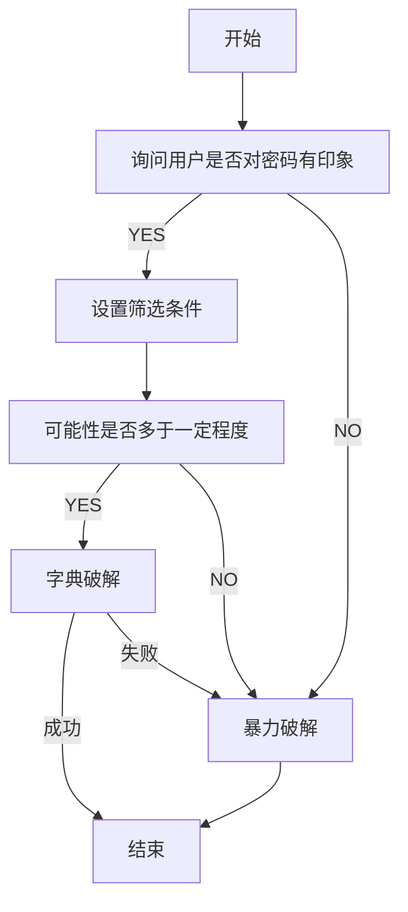

## ZIP 密码破解器

> 破解一个 `zip` 格式压缩包的密码

---

### 工具流程

```mermaid
graph TD
	A[开始] --> B[询问用户是否对密码有印象]
	B -- YES --> C[设置筛选条件] --> D[可能性是否多于一定程度] -- YES --> E[字典破解] -- 成功 --> G[结束]
	E -- 失败 --> F[暴力破解]
	B -- NO --> F
	D -- NO --> F
	F --> G
```

### 使用

1. `git clone` 或下载源码
2. 进入项目目录
3. 直接下载使用发行版内的可执行文件，放到项目根目录，或自行使用 `go` 编译后使用

### 注意

禁止用于非法用途，风险由您自负
